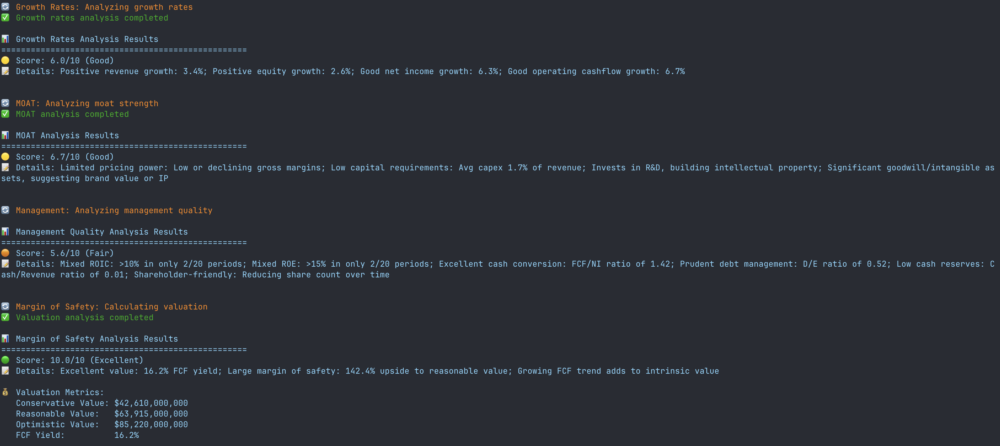
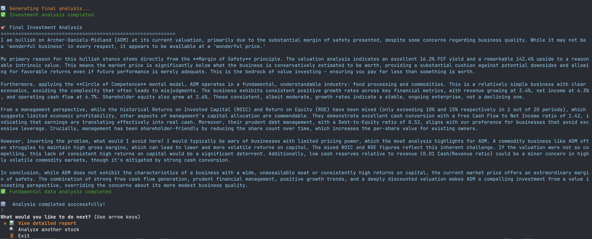

# Stock Research Agent with Alpha Vantage

AI-powered stock analysis tool that provides comprehensive fundamental research using Alpha Vantage API and advanced language models.

It's core valuation method is based on [Rule1Investing (Phil Town)](https://www.ruleoneinvesting.com) whose mentors where Warren Buffet and Charlie Munger. 

## Features

- 🔍 **Interactive CLI**: Beautiful questionary-based interface with progress indicators
- 📊 **Comprehensive Analysis**: Fetches overview, balance sheet, income statement, and cash flow data
- 🤖 **AI-Powered Research**: Uses LLM for web research and intelligent analysis (TBD)
- 💾 **Persistent Caching**: File-based cache system for efficient data management
- 📈 **Investment Insights**: Generates detailed reports with investment recommendations focusing on value investing
    - Key growth rates
    - MOAT analysis
    - Management numbers
    - Margin of safety
- 🎯 **User-Friendly**: Intuitive stock selection with confirmation dialogs
- 💰 **Free-Usage-Focused**: Integrates APIs with free tier to allow stock analysis without monthly bills 
    - [Alphavantage](https://www.alphavantage.co/support/#api-key)
    - [Google Gemini AI](https://ai.google.dev/gemini-api/docs/api-key)
    - Crawling: TBD

## Showcase
<p align="center">
  
</p>

<p align="center">
  
</p>

## Tech Stack

- **Language**: Python 3.12+
- **Package Manager**: uv
- **UI**: questionary (Interactive CLI)
- **Testing**: pytest
- **APIs**: Alpha Vantage, Google Gemini AI, Firecrawl

## Installation

```bash
# Clone the repository
git clone <repository-url>
cd alphavantage-mcp

# Install dependencies
uv sync
```

## Usage

```bash
# Run the stock research agent
python agent.py
```

The interactive CLI will guide you through:
1. Searching for a company by name
2. Selecting from matching stock results
3. Confirming your analysis choice
4. Viewing progress indicators during data collection
5. Reviewing analysis results
6. Saving reports or analyzing additional stocks

## Configuration

Create a `.env` file with your API keys:

```env
ALPHAVANTAGE_API_KEY=your_alpha_vantage_key
GOOGLE_API_KEY=your_google_api_key
FIRECRAWL_API_KEY=your_firecrawl_key
```

## Disclaimer
This project is for educational and research purposes only.

- Not intended for real trading or investment
- No investment advice or guarantees provided
- Creator assumes no liability for financial losses
- Consult a financial advisor for investment decisions
- Past performance does not indicate future results
- By using this software, you agree to use it solely for learning purposes.

## License
This project is licensed under the MIT License - see the LICENSE file for details.


